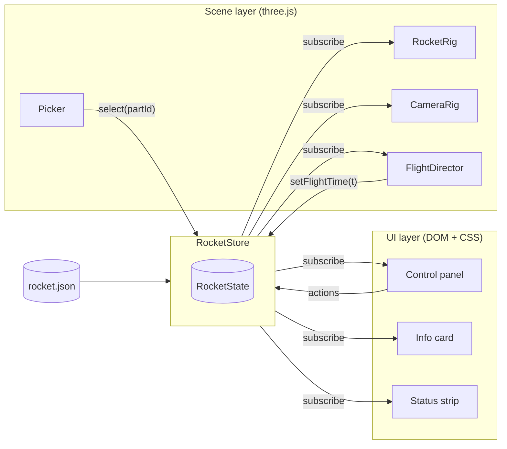

# Houston — Design Write-up

> Status: v1 built (M0–M5) · Owner: Estefan Hu · Last updated: 2026-10-07

## 1. Overview and goals

**Houston** is a browser-based "mission control" for a digital rocket. A 3D rocket, rendered with
[three.js](https://threejs.org), sits in the main viewport. Beside it is a
control panel the user drives to take the rocket apart, inspect each component, and fly it
through a simplified launch with staging.

The app is educational. A student or hobbyist should come away knowing what the major parts of a
launch vehicle are, how they fit together, and what happens to each part during a flight.

**Stack:** TypeScript · vanilla CSS · three.js, built and served with Vite. No UI framework and no backend.

**Success criteria**

- It runs in any current evergreen browser (Chrome, Edge, Firefox, Safari) with nothing to install.
- It is usable on desktop and tablet, and still readable on a phone.
- It can be hosted as a plain static site.
- A first-time visitor can explode the rocket, select a part, and run a launch within one minute and without instructions.

## 2. Non-goals (v1)

- User accounts, saved sessions, or any server-side component.
- Physically accurate simulation. The flight is a scripted, illustrative timeline, not an orbital mechanics model.
- VR/AR. three.js supports WebXR, so this stays a natural future extension (see §10).
- More than one rocket model. The data model allows more, but v1 ships one.

## 3. User experience

### Layout

```
┌───────────────────────────────────────────┬──────────────────┐
│ ┌───────────┐                             │  CONTROL PANEL ‹ │
│ │ Part info │                             │  ─ Explode       │
│ │   card    │     3D VIEWPORT             │  ─ Flight        │
│ └───────────┘  (three.js canvas)          │  ─ Parts tree    │
│                                           │                  │
│                                     [⌂]   │                  │
└───────────────────────────────────────────┴──────────────────┘
```

- The panel is docked on the right at about 320–360px wide and can be collapsed.
- Below about 768px wide the panel becomes a **bottom sheet** with three snap heights: peek, half, and full. The 3D image shifts up by half the sheet's height so the rocket stays centred in the visible area, and the info card docks just above the sheet.
- The **info card** floats over the top-left of the viewport rather than sitting in the panel, so opening it doesn't push the parts tree around.
- **Flight** sits above the parts tree so Launch is visible without scrolling.
- Mission-control styling: dark UI, monospace numerals, a status strip with the mission timer.
- **Schematic look** in the viewport: a blueprint-style background with a faint grid, flat-shaded parts with crisp edge outlines (`EdgesGeometry`), and a distinct outline colour for the selected part.

### Interactions

#### 3.1 Exploded view

| | |
|---|---|
| **Controls** | `Explode` slider (0 → 1), **Reset** button, keyboard arrows on the focused slider. |
| **Behaviour** | Each part moves from its assembled position toward `assembled + explodeOffset × factor`. Offsets point mostly along the rocket's long axis, so stages separate first and sub-components spread out after. Moves are eased with smoothstep, and slider input is smoothed so dragging feels fluid. |
| **Edge cases** | Hidden parts still move, so they reappear in the right place. While a flight is running the slider is disabled, because the flight owns the transforms. Reset animates back to 0 (or snaps back under reduced motion). The camera auto-frames the expanded bounds when the factor changes by a lot. |

#### 3.2 Toggle / isolate parts

| | |
|---|---|
| **Controls** | A collapsible **parts tree** (Rocket → Stage → Component), with a visibility checkbox and an **Isolate** button on each row, plus **Show all**. |
| **Behaviour** | A checkbox toggles a part's visibility, and toggling a stage cascades to its children. **Isolate** hides everything except that part and its descendants. Ghost mode is a later option. |
| **Edge cases** | A parent shows a mixed/indeterminate state when its children are partly hidden. Isolating an already-isolated part restores the previous visibility. If the selected part gets hidden, the selection clears. |

#### 3.3 Part info

| | |
|---|---|
| **Controls** | Click or tap a part in 3D, or activate a tree row. `Esc` clears the selection. |
| **Behaviour** | The part is highlighted with an outline/emissive tint, the camera eases to frame it, and an **info card** opens with name, purpose, materials, key specs, and a "did you know?" fact. The matching tree row is highlighted and scrolled into view. |
| **Edge cases** | Clicking empty space clears the selection. Clicking a hidden part's row shows its info but leaves the camera where it is. Content comes from data (see §4.3), so a part with no info shows a placeholder and does not error. |

#### 3.4 Simulated flight / staging

| | |
|---|---|
| **Controls** | **Launch / Pause / Resume**, a **scrub bar** with event markers, a 1×/2×/4× speed toggle, and **Abort/Reset**. A mission timer (`T-00:10` → `T+08:30`) is shown in the status strip. |
| **Behaviour** | A scripted timeline: countdown → ignition/liftoff → max-Q → MECO and **stage 1 separation** → stage 2 ignition → **fairing jettison** → SECO/orbit. Each event updates the panel with a short caption explaining what is happening and why. Separation reuses the exploded-view motion, with spent stages drifting away and tumbling. A chase camera follows the active stage. |
| **Edge cases** | Starting a flight resets the explode factor to 0 and shows every part (the user is told this). Scrubbing is deterministic, meaning the state is a pure function of `t`, so scrubbing backwards re-docks the stages. Under reduced motion, transitions are replaced with cuts and particles are minimal. Switching tabs pauses the flight. |

### Camera

Orbit, zoom (wheel or pinch), and pan (right-drag or two-finger). **Focus on part** frames the
selected part. A **Home** button (`⌂`) returns to the default view. Zoom is clamped so the camera
cannot pass through the model.

### Accessibility

- The panel is semantic HTML (`<button>`, `<input type="range">`, `<details>`/tree roles) and fully keyboard-operable with visible focus.
- Everything the 3D view teaches is also available as text in the panel, so the app works for screen readers and for users without WebGL2.
- `prefers-reduced-motion` turns off camera easing, particles, and animated explode.
- Colour contrast meets WCAG AA. State is never shown by colour alone.

## 4. Architecture

### 4.1 Layers

- **Scene layer:** plain TypeScript modules built on three.js. They own everything in 3D: transforms, materials, camera, picking, particles.
- **UI layer:** a vanilla TypeScript DOM overlay styled with vanilla CSS. It owns the control panel, the info card, and the status strip.
- **Store:** a small typed pub/sub module and the single source of truth. Neither layer talks to the other directly.



### 4.2 Store

The store is hand-rolled at roughly 50 lines, has no dependencies, and is easy to unit-test.

```ts
export type PartId = string;
export type FlightPhase =
  | 'idle' | 'countdown' | 'ascent' | 'stage-sep'
  | 'second-stage' | 'fairing-sep' | 'orbit' | 'aborted';

export interface RocketState {
  explode: number;                 // 0..1
  hidden: ReadonlySet<PartId>;
  isolated: PartId | null;
  selected: PartId | null;
  flight: {
    phase: FlightPhase;
    t: number;                     // seconds, negative during countdown
    playing: boolean;
    speed: 1 | 2 | 4;
  };
  reducedMotion: boolean;
}

export interface RocketStore {
  get(): RocketState;
  subscribe(fn: (s: RocketState, prev: RocketState) => void): () => void;
  dispatch(action: Action): void;  // pure reducer, so it is testable
}
```

The reducer is pure: `(state, action) → state`. Scene components compare `s` with `prev` and
touch only what changed, which avoids per-frame work when the state has not moved.

### 4.3 Data model

Parts and lessons live in `rocket.json`, separate from code, so people who don't write code can
edit the educational content. The JSON is validated at load time against the `Part` type, using a
small hand-written guard.

```ts
export interface Part {
  id: PartId;                      // 'stage1.engine.cluster'
  name: string;                    // 'First-stage engine cluster'
  parent: PartId | null;           // tree structure
  stage: 1 | 2 | 'payload';
  meshName: string;                // object name in the model (glTF node name)
  explodeOffset: [number, number, number];
  info: {
    summary: string;
    purpose: string;
    materials?: string[];
    specs?: Record<string, string>; // { Thrust: '7,600 kN' }
    funFact?: string;
  };
  flightEvents?: {
    event: 'separate' | 'jettison' | 'ignite' | 'shutdown';
    t: number;
    velocity?: [number, number, number];
    spin?: [number, number, number];
  }[];
}
```

### 4.4 Scene modules

Each module is a small class that takes the store and the three.js objects it needs. None of them
know about the DOM panel.

| Module | Responsibility |
|---|---|
| `Viewer` | Owns the `WebGLRenderer`, scene, lights and resize handling. Renders **on demand**: only when the store changes or the camera/flight is animating. |
| `RocketRig` | Loads the model (the GLB, or the code-built placeholder until one exists), maps each `Part.meshName` to its `Object3D`, caches the assembled transforms, and applies explode offset, visibility and highlight from store diffs. |
| `CameraRig` | `OrbitControls` with damping and clamped zoom, plus `focus(box)` and `home()`. Eases are skipped under reduced motion. |
| `Picker` | On a pointer click (not a drag), ray casts with `Raycaster` against visible parts, walks up to the owning part, and dispatches `select`. |
| `FlightDirector` | Dispatches `tick` while playing, applies the timeline pose of each part (`js/motion/timeline.ts`), drives exhaust particles and the chase camera. |

### 4.5 Repo layout

```
houston/
├─ index.html               # page shell: canvas host, panel markup, loading screen
├─ vite.config.ts
├─ js/
│  ├─ main.ts               # bootstrap: data → store → scene → UI
│  ├─ scene/                # viewer.ts, rocketRig.ts, placeholderRocket.ts, cameraRig.ts, picker.ts, flightDirector.ts
│  ├─ state/                # store.ts, reducer.ts, actions.ts
│  ├─ data/                 # rocket.json, parts.ts (types + validation)
│  ├─ motion/               # explode and flight-timeline math (pure)
│  └─ ui/                   # panel.ts, partsTree.ts, infoCard.ts, flightControls.ts
├─ styles/                  # tokens.css, layout.css, panel.css
├─ public/models/rocket.glb # once a real model exists
├─ test/                    # Vitest unit tests for pure modules
└─ docs/houston-design.md
```

## 5. 3D asset pipeline

- **Until a model exists**, `placeholderRocket.ts` builds the rocket in code from cylinders, cones and boxes, one object per part, named with the part's `meshName`. Everything else (explode, picking, flight) works the same against it.
- **Real model:** model in Blender, or start from a CC-BY/CC0 model with the licence recorded in `CREDITS.md`, and export as **GLB** to `public/models/`.
- **Each component is a separately named object** whose name matches `Part.meshName`, with its **origin at the attach point** so explode offsets and separation look right. The hierarchy mirrors the parts tree. `RocketRig` warns in the console about any part whose mesh is missing.
- Budget: about 150k triangles for the whole rocket. The schematic look needs few or no textures; keep any to 1k.
- Compress with `gltfpack` (meshopt) and load with `GLTFLoader` + `MeshoptDecoder`.

## 6. Tooling and workflow

- **Vite** is the dev server (`npm run dev`, with hot reload) and the production bundler (`npm run build` → `dist/`).
- **Type checking:** `tsc --noEmit` in strict mode.
- **Lint:** oxlint.
- **Tests:** Vitest for the pure modules only (reducer, data validation, flight timeline math). The 3D layer is verified by hand against a checklist.
- **CSS:** design tokens as custom properties in `tokens.css`, with BEM-ish class names. No preprocessor.
- `npm run check` runs lint, typecheck and tests together.

## 7. Hosting and deployment

- `npm run build` outputs a static site in `dist/`. Host it on **GitHub Pages**, Netlify, or Cloudflare Pages. No special headers are needed.
- Vite's `base` is `./`, so the same build works at a domain root or under a sub-path such as a GitHub Pages project site (`/houston/`).
- Serve `.js` and `.glb` with gzip or brotli (all three hosts do this by default).
- CI on every push to `main` runs lint, typecheck, tests and the build, then deploys.

## 8. Performance budget

| Metric | Target |
|---|---|
| Frame rate | 60 fps on a mid-range laptop, 30 fps or better on a recent tablet |
| Initial download | under 10 MB, with a branded loading screen showing progress |
| Time to interactive | under 4 s on broadband |
| Per-frame JS | Nothing while the state is unchanged; work happens only on store diffs or when flight/camera is animating |

## 9. Milestones

| # | Milestone | Done when |
|---|---|---|
| M0 | Project skeleton | The Vite project builds and serves, the old scaffolds are removed, and CI runs lint, typecheck, and tests. |
| M1 | Static rocket | The placeholder rocket is in the scene, the orbit camera and home button work, and the loading screen shows. |
| M2 | Explode + parts tree | The store, the explode slider, and visibility/isolate all work and stay in sync both ways. |
| M3 | Picking + info cards | Selecting a part from 3D or the tree highlights it, focuses the camera, and opens the card. Content exists for every part. |
| M4 | Flight sim | Timeline, scrub, staging, captions, and chase camera. |
| M5 | Polish + ship | Accessibility pass, reduced motion, mobile bottom sheet, performance pass, and public deploy. |

## 10. Open questions and risks

- **Rocket model source:** build our own or adapt a licensed one? This blocks M1 and decides how good the result looks.
- **Bundle size:** three.js core is roughly 150 KB gzipped. Import only the addons used (`OrbitControls`, `GLTFLoader`) to stay well inside the budget.
- **In-scene UI for future VR:** a DOM panel doesn't work in WebXR. If VR becomes a goal, the panel would need a 3D UI counterpart. Because the store is UI-agnostic, that only means adding another subscriber.
- **Content authorship and accuracy:** who writes and fact-checks the part info and flight captions? Should the rocket be generic, or modelled on a real vehicle?
- **Low-end devices:** decide on a fallback if WebGL2 is unavailable. The current plan is a text-only panel with a notice.
